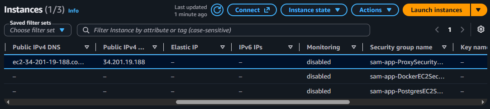

# Dropbox Lite — Cloud Deployment Guide


This document explains how to deploy Dropbox Lite on AWS using AWS SAM, CloudFormation, EC2, Docker, Tomcat, PostgreSQL, S3, and AWS Systems Manager (SSM).

The infrastructure is defined in `template.yaml`. CloudFormation provisions the network, EC2 instances, IAM roles, security rules, S3 buckets, and supporting AWS resources.

# Table of Contents

1. [Cloud Architecture](#1.-cloud-architecture)
2. [Public Proxy EC2](#2.-public-proxy-ec2)
3. [Private Docker EC2](#3.-private-docker-ec2)
4. [NAT Gateway](#4.-nat-gateway)
5. [PostgreSQL EC2](#5.-postgresql-ec2)
6. [Amazon S3](#6.-amazon-s3)
7. [IAM and AWS Systems Manager](#7.-iam-and-aws-systems-manager)
8. [Deployment Prerequisites](#8.-deployment-prerequisites)
9. [First-Time Deployment](#9.-first-time-deployment)
10. [Verify the Deployment](#10.-verify-the-deployment)
11. [Inspect Tomcat on the Docker EC2](#11.-inspect-tomcat-on-the-docker-ec2)
12. [Inspect PostgreSQL on the PostgreSQL EC2](#12.-inspect-postgresql-on-the-postgresql-ec2)


## 1.-Cloud-Architecture

The application runs on a private EC2 instance behind a public Nginx reverse proxy. PostgreSQL runs on a separate private EC2 instance, and S3 stores application files and uploaded user files.


The main architecture is:

```text

                         Internet

                            |

                     Internet Gateway

                            |

              +-------------+--------------+

              |                            |

       Public Proxy Subnet             NAT Subnet

       192.168.1.0/24                192.168.2.0/24

              |                            |

         Nginx Proxy                  NAT Gateway

         Public EC2                        |

              |                            |

              |                     Private Internet

              |                            |

              +---------> Docker EC2 <---->+

                         192.168.3.0/24

                              |

                         Tomcat :8080

                              |

                       Dropbox Lite WAR

                         /           \

                        /             \

                       v               v

              PostgreSQL EC2          S3

              192.168.5.0/24      User Files bucket, Application War bucket

```

The VPC uses the CIDR block `192.168.0.0/16`.

|Component|Subnet / location|Purpose|
|---|---|---|
|Nginx Proxy EC2|`192.168.1.0/24`|Receives public HTTP requests and forwards them to Tomcat|
|NAT Gateway|`192.168.2.0/24`|Provides outbound internet access to private instances|
|Docker EC2|`192.168.3.0/24`|Runs the Tomcat container and application WAR|
|PostgreSQL EC2|`192.168.5.0/24`|Runs PostgreSQL and stores application metadata|
|Application S3 bucket|S3|Stores the WAR downloaded during instance startup|
|User Files S3 bucket|S3|Stores user-uploaded files|
|EBS volume|Attached to PostgreSQL EC2|Persists PostgreSQL data under `/data/postgresql`|

## 2.-Public-Proxy-EC2

The public EC2 instance runs Nginx and receives HTTP requests on port `80`.

Nginx forwards incoming requests to the private Docker EC2 on port `8080`.

The Docker EC2 does not require a public IP address or direct inbound internet access for application traffic.

### DNS configuration

The template creates a Route 53 public hosted zone for `dropbox-lite.com` and defines the record:

```text
www.rspk.dropbox-lite.com
```

**Important:** The domain is not registered . so, you cant be use this dns until the it got registered.
Until then you can use the public IPv4 address of the Proxy EC2:

```text
http://<PROXY_PUBLIC_IP>/dropbox-lite/
```

Replace `<PROXY_PUBLIC_IP>` with the actual public IP address shown in the EC2 console.



## 3.-Private-Docker-EC2

The Docker EC2 is located in `192.168.3.0/24` and does not have a public IP address.

Its startup script performs the following operations:

1. Installs Docker.
2. Starts Docker and enables it at boot.
3. Creates `/home/ec2-user/webapps`.
4. Downloads application files from the application S3 bucket.
5. Pulls the `tomcat:11-jdk21-temurin` image.
6. Starts the Tomcat container.
7. Mounts the application directory into Tomcat.
8. Passes the owner email configuration to the container.

Need to enter the Owner mail, password for sending Otp as CloudFormation parameter while deploying

## 4.-NAT-Gateway

The Docker and PostgreSQL EC2 instances are private but require outbound connectivity for package installation, software updates, Docker image downloads, AWS service access, and SMTP.

Their default route is:

```text
0.0.0.0/0 -> NAT Gateway
```

The NAT Gateway is placed in `192.168.2.0/24` and uses an Elastic IP.

The NAT Gateway provides outbound connectivity; it does not make the private EC2 instances directly accessible from the internet.

## 5.-PostgreSQL-EC2

PostgreSQL runs on a separate EC2 instance in `192.168.5.0/24`.

The intended database connection is:

```text
Docker EC2
    |
    | TCP :5432
    v
PostgreSQL EC2
```

The PostgreSQL security group allows incoming database connections from the Docker subnet on port `5432`.

The startup script:

1. Detects the attached EBS volume.
2. Creates an XFS filesystem if the volume is new.
3. Mounts the volume at `/data`.
4. Installs PostgreSQL 18.
5. Configures PostgreSQL to use `/data/postgresql`.
6. Configures remote database access for the Docker subnet.
7. Sets the PostgreSQL password.
8. Creates the application database and login role.

The database name is:

```text
dropbox-lite
```

The PostgreSQL data directory is:

```text
/data/postgresql
```

The EBS volume is separate from the EC2 root volume, allowing database data to persist independently of the instance's root disk.

The template creates the application database and role during initialization. Create any additional application tables using the SQL definitions documented in the entity files.

## 6.-Amazon-S3

Dropbox Lite uses two separate S3 buckets.

### Application bucket

This bucket must exist before the first infrastructure deployment.

you need to create a bucket and cp the war to the bucket using

```text
aws s3 mb s3://universally_unique_name
aws s3 cp path_to_war_file s3://universally_unique_name
```

It contains the WAR downloaded by the Docker EC2 startup script.
The bucket name should be provided through the CloudFormation parameter:

```text
S3BucketName
```

### User-files bucket

The template creates a separate bucket for uploaded user files:

```text
dropbox-lite.rc180920261131ist
```

The Docker EC2 IAM role is granted permissions to list the bucket and read, upload, and delete objects, including operations on object versions.

## 7.-IAM-and-AWS-Systems-Manager

The Proxy, Docker, and PostgreSQL EC2 instances are assigned IAM instance profiles with the `AmazonSSMManagedInstanceCore` managed policy.

This enables AWS Systems Manager to manage the instances without requiring SSH access or public IP addresses.

Use **AWS Systems Manager Session Manager** to open a shell on either private instance.

The Docker EC2 and PostgreSQL EC2 can be accessed independently. For example, use the Docker instance to inspect Tomcat and use the PostgreSQL instance to inspect the database service.

See the operational instructions below for the exact connection steps.

## 8.-Deployment-Prerequisites

Install and configure the following tools on your local machine:

- Java 21
- Maven
- AWS CLI
- AWS SAM CLI
- An AWS account with permissions to create the resources defined in `template.yaml`

Configure AWS credentials using an AWS CLI profile or another supported credential provider.

Verify the AWS CLI installation:

```bash
aws --version
```

Verify the SAM CLI installation:

```bash
sam --version
```


## 9.-First-Time-Deployment

Run the following commands from the project root, where `pom.xml` and `template.yaml` are located.

### Step 1: Build the WAR

```bash
mvn clean package
```

The expected output is:

```text
target/dropbox-lite.war
```

Confirm that the WAR exists before continuing.

### Step 2: Create the application S3 bucket

The application bucket is separate from the user-files bucket created by CloudFormation.

Create a globally unique bucket name:

```bash
aws s3 mb s3://<application-bucket-name> --region <aws-region>
```

### Step 3: Upload the WAR

```bash
aws s3 cp target/dropbox-lite.war s3://<application-bucket-name>/dropbox-lite.war
```

### Step 4: Build the SAM application

```bash
sam build
```

This prepares the SAM application for deployment.

### Step 5: Deploy the infrastructure

```bash
sam deploy --guided
```

During the guided deployment, provide values for the stack name, AWS Region, and the CloudFormation parameters defined in `template.yaml`.

|Parameter|Value|
|---|---|
|`S3BucketName`|Existing application S3 bucket name|
|`PostgresUsername`|PostgreSQL application login username|
|`PostgresPassword`|Strong database password|
|`EmailForNotifications`|Email address for SNS notifications|
|`OwnerMail`|Email address used by the application|
|`OwnerPassword`|Credential required by the application's email configuration|

Review the proposed changes before approving deployment.

SAM saves deployment settings in `samconfig.toml`, allowing subsequent deployments to use:

```bash
sam build
sam deploy
```

## 10.-Verify-the-Deployment

After CloudFormation reports that the stack has been created successfully:

1. Open the AWS CloudFormation console.
2. Select the deployed Dropbox Lite stack.
3. Open the **Resources** tab to identify the Proxy, Docker, and PostgreSQL EC2 instances.
4. Open the EC2 console and check that the instances are running.
5. Check that both private instances appear as managed nodes in Systems Manager.
6. Open the application using the proxy's public IPv4 address.


## 11.-Inspect-Tomcat-on-the-Docker-EC2

Run the following commands **inside the Docker EC2 SSM session**, not on your local machine.

### Become root

```bash
sudo -i
```

### Check Docker

```bash
docker ps
```

List all containers, including stopped containers:

```bash
docker ps -a
```

List locally available images:

```bash
docker images
```

Follow the logs continuously:

```bash
docker logs -f tomcat
```

Open a shell inside the Tomcat container:

```bash
docker exec -it tomcat bash
```

Inside the container, Tomcat's application directory is:

```text
/usr/local/tomcat/webapps/
```

Exit the container shell with:

```bash
exit
```

## 12.-Inspect-PostgreSQL-on-the-PostgreSQL-EC2

### Connect to PostgreSQL

Switch to the PostgreSQL operating-system user:

```bash
sudo -u postgres psql -d dropbox-lite
```


List the tables:

```sql
\dt
```

Inspect a table's columns and constraints:

```sql
\d table_name
```

Exit the PostgreSQL shell:

```sql
\q
```

After that create the table from the entity comments 