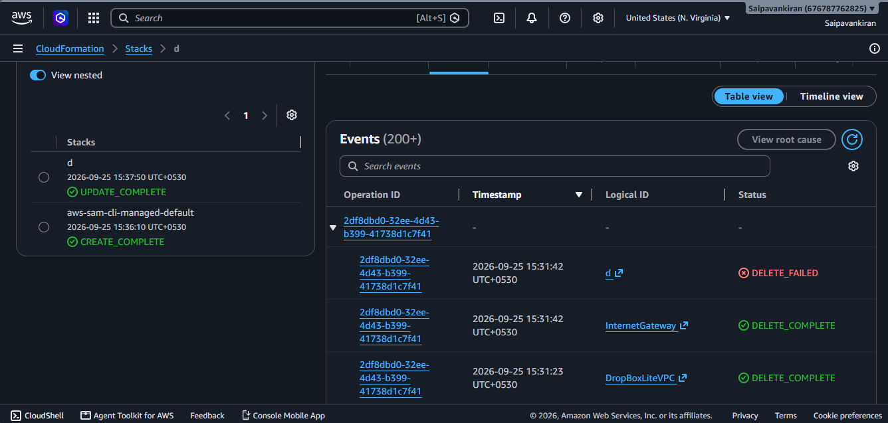
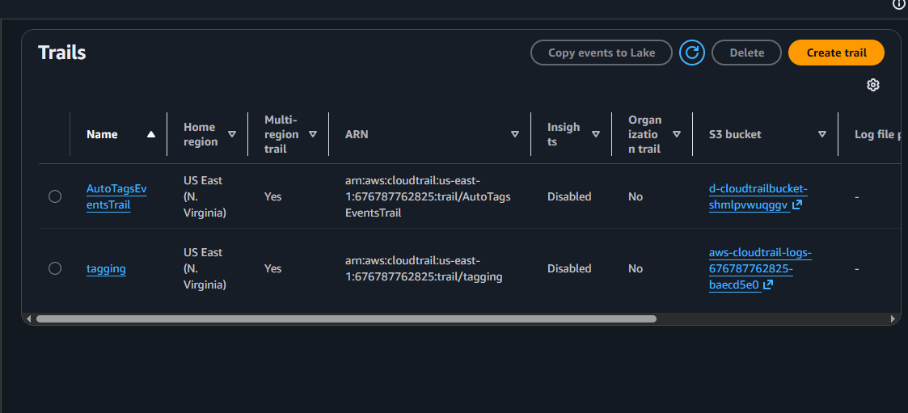
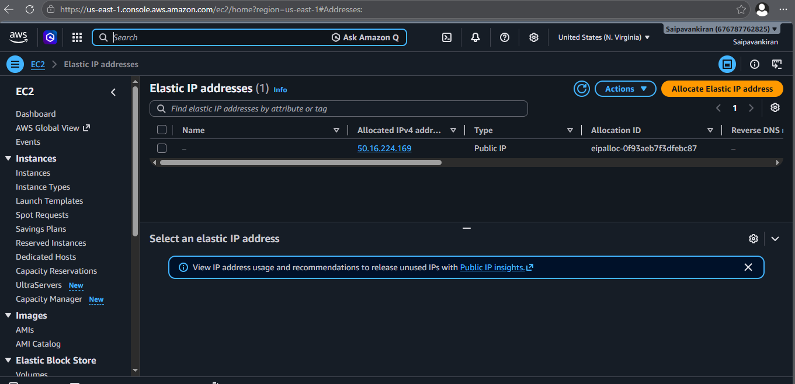
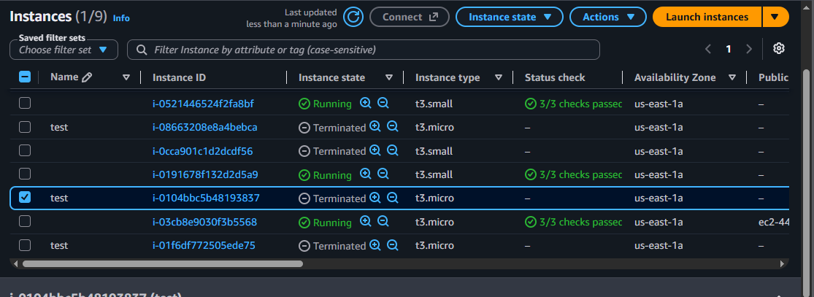
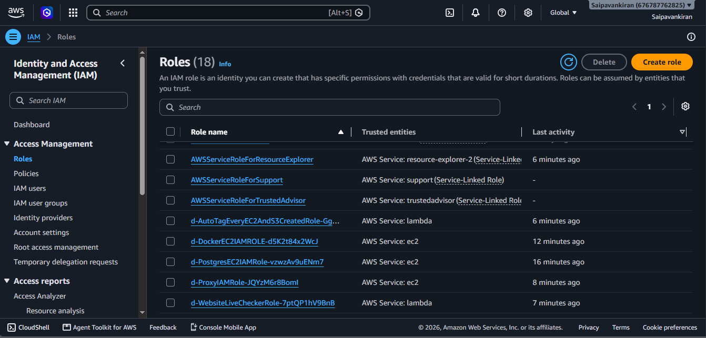
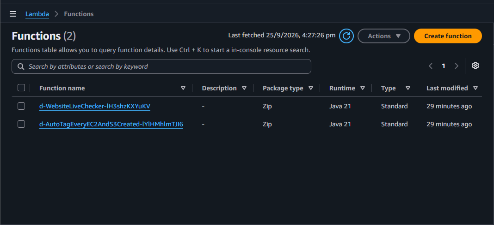
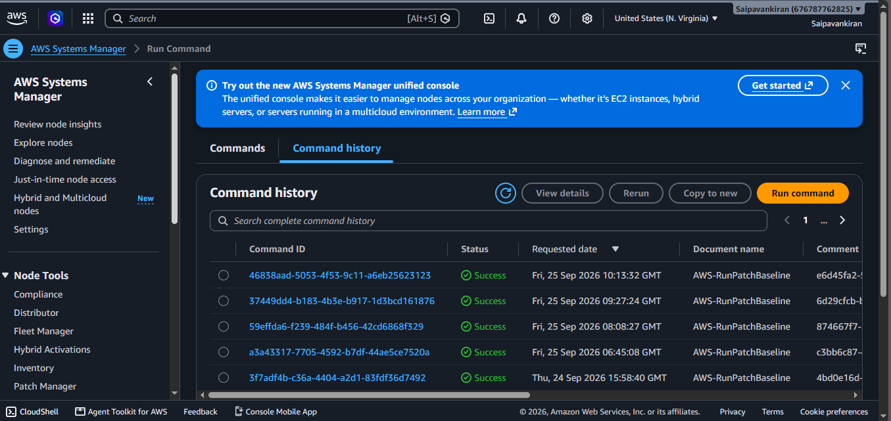
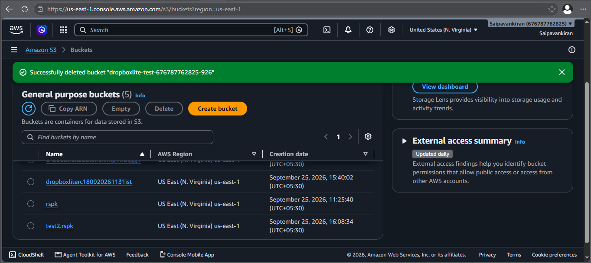
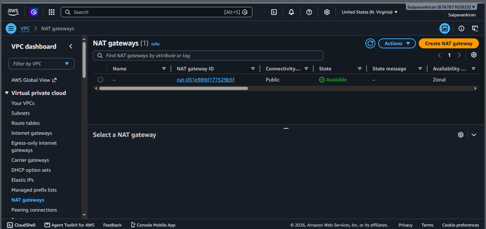

# Dropbox Lite

Dropbox Lite is a Java 21 backend application built with Spring MVC and deployed on AWS. It uses Amazon S3 for file storage, PostgreSQL for application data, and Docker with Apache Tomcat to run the application.

The project includes a local Docker Compose environment and an AWS deployment architecture provisioned using AWS SAM and CloudFormation.

## Tech Stack

| Category             | Technologies                                             |
| -------------------- | -------------------------------------------------------- |
| Language             | Java 21                                                  |
| Backend              | Spring MVC 7, Spring ORM, Spring Data JPA, Hibernate ORM |
| Security             | Spring Security, JJWT                                    |
| Database             | PostgreSQL 18                                            |
| Caching              | Redis, Jedis                                             |
| Object Storage       | Amazon S3, AWS SDK                                       |
| Cloud Infrastructure | AWS EC2, VPC, NAT Gateway, IAM, SSM, CloudFormation      |
| Email                | Jakarta Mail, Angus Mail                                 |
| Validation           | Jakarta Validation, Hibernate Validator                  |
| Connection Pooling   | HikariCP                                                 |
| Serialization        | Jackson                                                  |
| Logging              | Log4j2, SLF4J                                            |
| Application Server   | Apache Tomcat 11                                         |
| Containerization     | Docker, Docker Compose                                   |
| Deployment           | AWS SAM, CloudFormation                                  |
| Reverse Proxy        | Nginx                                                    |

## Architecture

More details at
[Cloud Deployment Guide](Cloud.Deploy.Readme.md)

The cloud deployment consists of:

- **Nginx Reverse Proxy:** Receives public HTTP requests and forwards them to the application.
- **Private Application Server:** Runs the Java WAR inside a Docker container using Apache Tomcat.
- **PostgreSQL:** Stores application metadata and relational data on a separate EC2 instance.
- **Amazon S3:** Stores uploaded user files and the application WAR.
- **VPC and Subnets:** Isolate the public proxy and private application/database instances.
- **NAT Gateway:** Provides outbound internet connectivity to private instances.
- **IAM and Systems Manager:** Provide instance permissions and remote administration without requiring direct SSH access.

## Screenshots
## AWS CloudFormation



## AWS CloudTrail



## EC2 Instance






## IAM Roles



## AWS Lambda



## Maintenance



## Public IP Address


## Amazon S3



## VPC




### Local Development and Testing

Run Dropbox Lite locally using Docker Compose, configure environment variables, inspect application logs, access PostgreSQL, and verify the application.

**[Read the Local Testing Guide](Local.Testing.Readme.md)**

### AWS Cloud Deployment

Deploy the infrastructure using AWS SAM and CloudFormation. The guide covers the AWS resources, architecture, initial deployment, SSM access to EC2 instances, and PostgreSQL administration

**[Read the Cloud Deployment Guide](Cloud.Deploy.Readme.md)**

### PostgreSQL Setup

For database-specific setup and instructions, see the [PostgreSQL Guide](Postgres.Readme.md).

## Project Structure

```text
dropbox-lite/
├── images/                    # AWS deployment screenshots
├── src/main/                  # Java application source code
├── tomcat/                    # Tomcat Docker configuration
├── Cloud.Deploy.Readme.md     # AWS deployment instructions
├── Local.Testing.Readme.md    # Local development guide
├── Postgres.Readme.md         # PostgreSQL instructions
├── compose.yaml               # Local Docker Compose configuration
├── pom.xml                    # Maven dependencies and build
└── template.yaml              # AWS SAM / CloudFormation template
```

## Prerequisites

For local execution:

- Java 21 and Maven for building the application.
- Docker and Docker Compose.
- The environment variables required by the application.

For AWS deployment:

- An AWS account with the necessary permissions.
- AWS CLI and AWS SAM CLI.
- Java 21 and Maven.
- An existing application S3 bucket for the packaged WAR.

Refer to the relevant deployment guide for the complete setup instructions.
